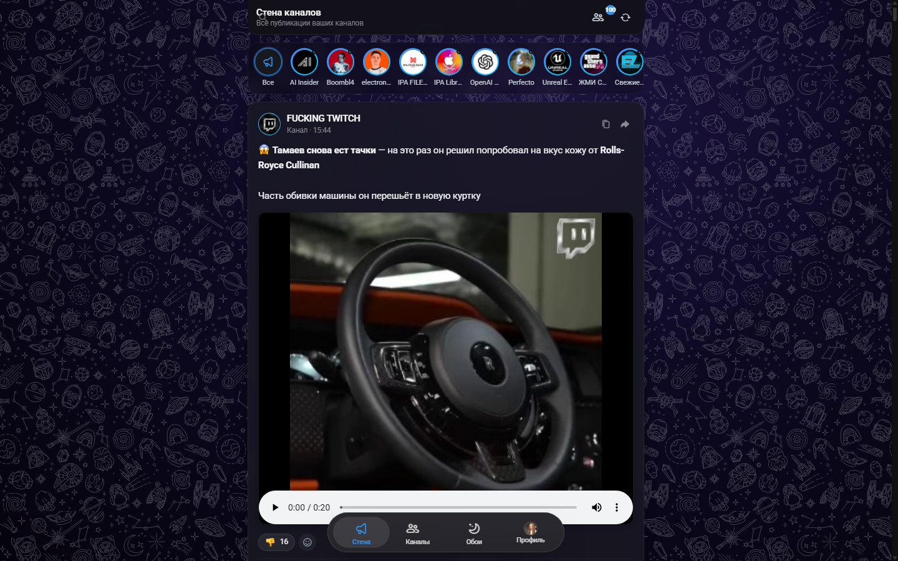
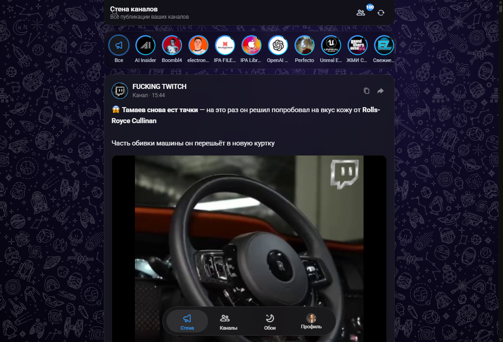
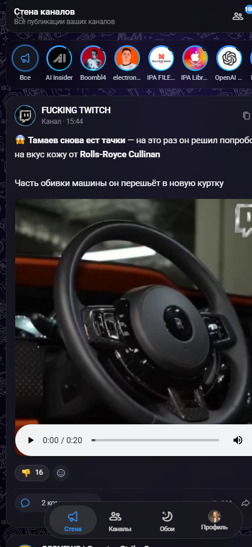

# ✈️ TeleX — Стена каналов (Liquid Glass Stream Pro)

<div align="center">

[](https://www.python.org/)
[](https://fastapi.tiangolo.com)
[](https://github.com/LonamiWebs/Telethon)
[](#)

<p align="center">
  <b>Легкое, быстрое и стильное веб-приложение для чтения всех ваших подписок Telegram в виде единой ленты (Стена каналов в стиле Twitter / X) с поддержкой официальных векторных обоев Telegram, плавающего iOS Perfect Glass Dock и нативным окном настроек.</b>
</p>

</div>

---

## 📸 Скриншоты интерфейса

### 🖥️ Главный экран: Стена каналов и плавающий Liquid Glass Dock
<div align="center">
  
</div>

<br>

<table align="center" width="100%">
  <tr>
    <td align="center" width="60%">
      <b>⚙️ Нативное окно настроек и профиля</b><br><br>
      
    </td>
    <td align="center" width="40%">
      <b>📱 Адаптивный мобильный вид</b><br><br>
      
    </td>
  </tr>
</table>

---

## ⚡ Ключевые возможности

* ✈️ **Оригинальный брендинг TeleX**:
  * Фирменная эстетика Telegram в сочетании с лентой каналов в стиле Twitter/X.
  * Чистый интерфейс без перегруженных панелей и рекламы.
* 🫧 **Плавающая стеклянная панель (iOS Perfect Glass Dock)**:
  * Нижний док по оптической формуле Apple iOS Dark Mode (`backdrop-filter: blur(45px) saturate(220%)`).
  * Быстрый доступ к разделам: **Стена**, **Каналы**, **Обои**, **Настройки / Профиль**.
* 🖼️ **Официальные векторные обои Telegram (Wallpaper Engine)**:
  * 9 оригинальных SVG-паттернов Telegram (`t.me/bg/...`) с чёткими белыми контурами + глубокий OLED Black фон.
  * Мгновенное переключение тем оформления на лету.
* 💬 **Инлайн-комментарии с формой ответа**:
  * Чтение комментариев прямо под публикацией без перехода в отдельные чаты.
  * Возможность оставлять ответы непосредственно из ленты.
* ❤️ **Быстрые реакции и закладки**:
  * Удобное всплывающее меню реакций на посты.
  * Сохранение избранных постов в локальное хранилище и «Избранное» Telegram.
* ⚡ **Мгновенный кэш (0ms Fast Cache)**:
  * Моментальный запуск и отображение постов/аватаров без задержек сети.
* 📱 **Полная адаптивность**:
  * Идеально работает на мониторах любого разрешения, планшетах и смартфонах.

---

## 🚀 Установка и быстрый запуск

### 1. Клонирование репозитория
```bash
git clone https://github.com/Gl1ch5/TgX.git
cd TgX
```

### 2. Установка зависимостей
Требуется **Python 3.10+**:
```bash
pip install fastapi uvicorn telethon pydantic pillow
```

### 3. Запуск приложения
Запустите скрипт:
```bash
python run.py
```
*Или в Windows просто дважды кликните по файлу `start_telegram_x.bat`.*

Приложение автоматически откроется в вашем браузере по адресу:
👉 **[http://127.0.0.1:8000](http://127.0.0.1:8000)**

---

## 🔐 Как войти в свой аккаунт Telegram (Авторизация)

При первом запуске откроется окно авторизации TeleX. Доступно два удобных способа входа:

```
┌────────────────────────────────────────────────────────┐
│                   Вход в TeleX                         │
│  [ Быстрый вход по QR ]   |   [ По номеру телефона ]  │
└────────────────────────────────────────────────────────┘
```

### Способ 1: Вход по QR-коду (Рекомендуемый, самый быстрый)
1. В окне входа выберите вкладку **«QR-код»**.
2. Откройте официальное приложение **Telegram на смартфоне**.
3. Перейдите в **Настройки → Устройства → Подключить устройство** (Settings → Devices → Link Desktop Device).
4. Наведите камеру смартфона на QR-код на экране компьютера.
5. Приложение мгновенно выполнит вход и начнет загрузку ленты ваших каналов!
   *(Если у вас включен двухфакторный облачный пароль 2FA, введите его в появившемся поле).*

---

### Способ 2: Вход по номеру телефона
1. Выберите вкладку **«Номер телефона»**.
2. Введите свой номер телефона в международном формате (например, `+79991234567` или `+380...`).
3. Нажмите кнопку **«Получить код»**.
4. В официальное приложение Telegram вам придет служебное сообщение с 5-значным кодом подтверждения.
5. Введите полученный код в поле на экране и нажмите **«Войти»**.
6. При наличии 2FA введите свой облачный пароль.

---

## ⚙️ Настройка параметров и Прокси (Опционально)

По умолчанию приложение готово к работе. При необходимости вы можете настроить собственные ключи Telegram API или сетевой прокси через переменные окружения или создав файл `.env`:

```env
# Ваши ключи с https://my.telegram.org (опционально)
TG_API_ID=27451332
TG_API_HASH=1462d961e4a7bf6b5139309255f09fd6

# Настройки HTTP/SOCKS5 Прокси (если требуется обход блокировок)
TG_PROXY_HOST=127.0.0.1
TG_PROXY_PORT=1080
TG_PROXY_TYPE=http
TG_PROXY_USER=
TG_PROXY_PASS=
```

---

## 🧱 Архитектура проекта

```
TgX/
├── app/
│   ├── backend/
│   │   ├── config.py           # Конфигурация, пути и прокси
│   │   ├── main.py             # FastAPI бэкенд и REST API эндпоинты
│   │   └── telegram_service.py # Telethon MTProto клиент, парсер форматирования и кэш
│   ├── static/
│   │   ├── css/
│   │   │   ├── liquid-glass.css    # Liquid Glass дизайн-система и iOS Dock
│   │   │   ├── telegram-theme.css  # Тематизация и стили карточек
│   │   │   └── animations.css      # Плавные микроанимации
│   │   ├── js/
│   │   │   ├── app.js              # Инициализация и роутинг
│   │   │   ├── api.js              # Клиент взаимодействия с бэкендом
│   │   │   ├── state.js            # Реактивное состояние
│   │   │   └── components/         # Модули интерфейса (лента, модалки, обои, плеер)
│   │   ├── icons/                  # Пакет векторных иконок Liquid Glass
│   │   └── wallpapers/             # Каталог оригинальных SVG обоев Telegram
│   └── sessions/                   # Хранилище локальных сессий (в .gitignore)
├── assets/
│   └── screenshots/                # Скриншоты для документации
├── run.py                          # Главный файл запуска сервера
└── start_telegram_x.bat            # Windows Launcher
```

---

## 📄 Лицензия

Распространяется под лицензией MIT. Подробности см. в файле [LICENSE](LICENSE).
