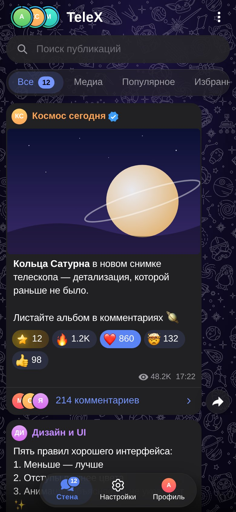
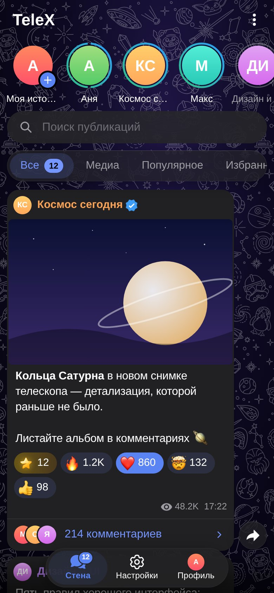
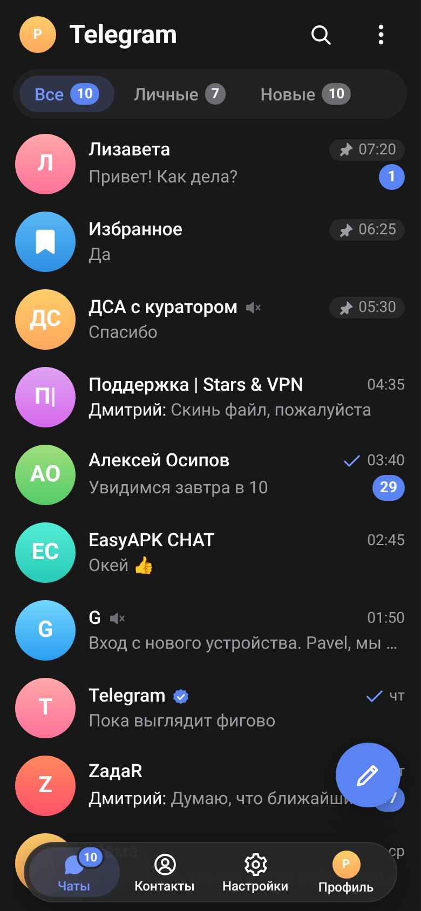

# TeleX

<div align="center">


**Неофициальный клиент Telegram в браузере, на Android и Windows.**
Два режима на одной учётной записи: лента всех каналов и обычные чаты.

[Сайт](https://telex-web.ru/) · [TeleX](https://telex-web.ru/app/static/) · [Telegram You](https://telex-web.ru/app/static/chat/) · [Android](https://github.com/Gl1ch5/TgX/releases/download/nightly/TeleX-android.apk) · [Windows](https://github.com/Gl1ch5/TgX/releases/tag/nightly)






</div>

## Что внутри

**TeleX** — публикации всех ваших каналов одной лентой. Истории, комментарии, реакции, премиум-эмодзи, закреплённые сообщения, поиск по каналу.

**Telegram You** (бета) — обычный клиент: список чатов с папками и архивом, переписка, ответы и пересылки, фото, видео, голосовые и файлы, отправка и редактирование, «печатает…», галочки прочитанного, контакты. Внешний вид повторяет Telegram для Android.

Общее для обоих:

- вход как в Telegram: номер телефона с выбором страны, код (в том числе по SMS), облачный пароль, QR-код;
- русский, английский, испанский, португальский и украинский;
- светлая и тёмная тема, по умолчанию как на устройстве;
- настройки чатов: цветовые темы, обои, цвет имён, размер текста, скругления;
- всё работает на вашем устройстве, своего сервера у проекта нет.

## Как это устроено

Клиент Telegram ([GramJS](https://github.com/gram-js/gramjs), MTProto по WebSocket) запускается прямо на странице, в Web Worker. Сессия лежит в `localStorage`; «Выйти» завершает сеанс в Telegram и стирает локальные данные. Фото и видео отдаёт Service Worker, поэтому они кэшируются и видео проигрывается потоком.

Если Telegram в вашей сети заблокирован, нужен VPN: приложение соединяется с серверами Telegram напрямую.

## Установка

- **Браузер** — откройте [telex-web.ru](https://telex-web.ru/), вход не нужен до первого запуска.
- **Android 7.0+** — [TeleX-android.apk](https://github.com/Gl1ch5/TgX/releases/download/nightly/TeleX-android.apk). Разрешите установку из неизвестных источников; дальше приложение обновляется само.
- **Windows** — `TeleX-Setup.exe` или `TeleX-Portable.exe` из [релиза](https://github.com/Gl1ch5/TgX/releases/tag/nightly). Файлы не подписаны, SmartScreen может предупредить: «Подробнее» → «Выполнить в любом случае».

## Разработка

```bash
npm install
npm run serve        # http://localhost:8765
npm test             # браузерные проверки (Playwright), включая оба клиента
npm run i18n         # проверка и сборка переводов
```

Без аккаунта Telegram можно открыть демо: `http://localhost:8765/chat/?fake=1`.

| Папка | Назначение |
|---|---|
| `app/static/` | клиент TeleX: `js/telegram.js` (движок), `js/views`, `js/components`, `css/tx`, `sw.js` |
| `app/static/chat/` | клиент Telegram You |
| `native/android`, `native/desktop` | оболочки WebView и Electron |
| `tools/` | сборка GramJS, переводы, извлечение иконок, тесты |
| `site/`, `index.html` | лендинг |
| `promo/`, `promo-materials/` | ролики, логотип, тексты для соцсетей |
| `docs/` | [архитектура](docs/architecture.md), [планы](docs/roadmap.md), [заметки по API Telegram](docs/telegram-api.md), [тестирование](docs/testing.md) |

Сборка Android: `cd native/android && ./gradlew assembleDebug` (JDK 17, Android SDK). Windows: `cd native/desktop && npm ci && npm run dist:win`. Релизы собирает GitHub Actions (`.github/workflows`).

## Автор

[@grzxk](https://t.me/grzxk) · [github.com/Gl1ch5](https://github.com/Gl1ch5)

## Лицензия

Код — MIT ([LICENSE](LICENSE)). Иконки в `app/static/icons/android/` взяты из открытых исходников [Telegram для Android](https://github.com/DrKLO/Telegram) (GPLv2).
TeleX — неофициальный клиент и не связан с Telegram FZ-LLC.
