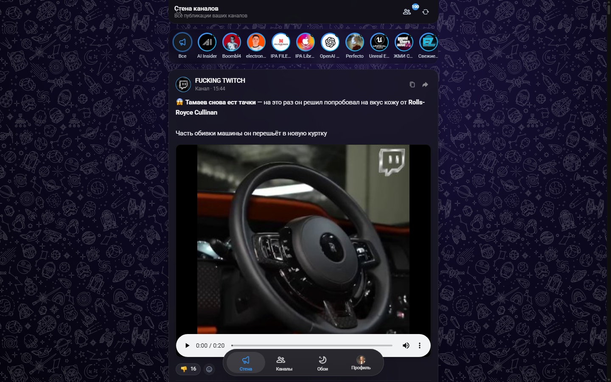
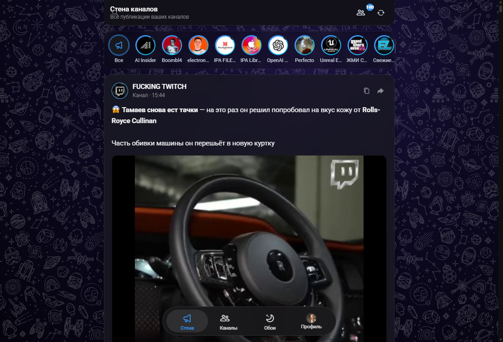
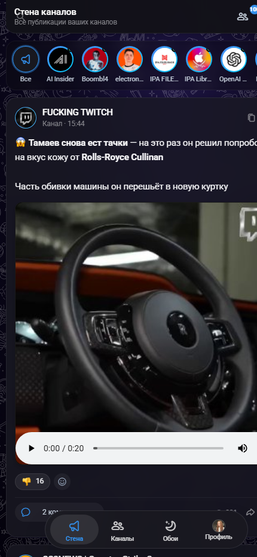

# ✈️ TeleX — Стена каналов (Liquid Glass Stream Pro)

<div align="center">

[](https://gl1ch5.github.io/TgX/)
[](https://github.com/gram-js/gramjs)
[](#)

<p align="center">
  <b>Легкое, быстрое и стильное веб-приложение для чтения всех ваших подписок Telegram в виде единой ленты (Стена каналов в стиле Twitter / X) с поддержкой официальных векторных обоев Telegram, плавающего iOS Perfect Glass Dock и нативным окном настроек.</b>
</p>

</div>

---

## 📸 Скриншоты интерфейса

### 🖥️ Главный экран: Стена каналов и плавающий Liquid Glass Dock
<div align="center">
  
</div>

<br>

<table align="center" width="100%">
  <tr>
    <td align="center" width="60%">
      <b>⚙️ Нативное окно настроек и профиля</b><br><br>
      
    </td>
    <td align="center" width="40%">
      <b>📱 Адаптивный мобильный вид</b><br><br>
      
    </td>
  </tr>
</table>

---

## ⚡ Ключевые возможности

* ✈️ **Оригинальный брендинг TeleX**:
  * Фирменная эстетика Telegram в сочетании с лентой каналов в стиле Twitter/X.
  * Чистый интерфейс без перегруженных панелей и рекламы.
* 🫧 **Плавающая стеклянная панель (iOS Perfect Glass Dock)**:
  * Нижний док по оптической формуле Apple iOS Dark Mode (`backdrop-filter: blur(45px) saturate(220%)`).
  * Быстрый доступ к разделам: **Стена**, **Каналы**, **Обои**, **Настройки / Профиль**.
* 🖼️ **Официальные векторные обои Telegram (Wallpaper Engine)**:
  * 9 оригинальных SVG-паттернов Telegram (`t.me/bg/...`) с чёткими белыми контурами + глубокий OLED Black фон.
  * Мгновенное переключение тем оформления на лету.
* 💬 **Инлайн-комментарии с формой ответа**:
  * Чтение комментариев прямо под публикацией без перехода в отдельные чаты.
  * Возможность оставлять ответы непосредственно из ленты.
* ❤️ **Быстрые реакции и закладки**:
  * Удобное всплывающее меню реакций на посты.
  * Сохранение избранных постов в локальное хранилище и «Избранное» Telegram.
* ⚡ **Мгновенный кэш (0ms Fast Cache)**:
  * Моментальный запуск и отображение постов/аватаров без задержек сети.
* 📱 **Полная адаптивность**:
  * Идеально работает на мониторах любого разрешения, планшетах и смартфонах.

---

## 🚀 Открыть

👉 **[gl1ch5.github.io/TgX](https://gl1ch5.github.io/TgX/)** — ничего устанавливать не нужно: зашёл, вошёл в Telegram, читаешь.

TeleX работает **целиком в браузере**: клиент Telegram (MTProto через защищённый WebSocket) запускается прямо на странице, сервера у проекта нет. Ваша сессия хранится только в `localStorage` вашего браузера и никуда больше не отправляется. Кнопка «Выйти» завершает сессию в Telegram и стирает все локальные данные.

> Если Telegram в вашей сети заблокирован, нужен VPN — браузер подключается к серверам Telegram напрямую.

---

## 📱 Android

Приложение для Android — это тонкая нативная оболочка (WebView), которая открывает живой сайт, поэтому всегда показывает актуальную версию TeleX. Сверху добавлены нативные удобства: кнопка «Назад» закрывает вложенные экраны, ссылки `t.me` и внешние сайты открываются в Telegram/браузере, тёмный экран запуска без белой вспышки, экран «Нет соединения» с кнопкой «Повторить» и скачивание файлов в «Загрузки/TeleX».

**Установка:**
1. Скачайте `TeleX-android.apk` из релиза **[nightly](https://github.com/Gl1ch5/TgX/releases/tag/nightly)** (файл пересобирается автоматически).
2. Откройте его на телефоне и разрешите установку из неизвестных источников, когда Android попросит (Настройки → Приложения → ваш браузер/файловый менеджер → «Установка неизвестных приложений»).
3. Новые сборки ставятся поверх старой — вход в Telegram сохраняется.

Требуется Android 7.0 и новее.

**Сборка локально** (нужны JDK 17 и Android SDK, путь к SDK — в `ANDROID_HOME` или `native/android/local.properties`):

```bash
cd native/android
./gradlew assembleDebug
# APK: native/android/app/build/outputs/apk/debug/app-debug.apk
```

Адрес сайта задаётся в одном месте: `native/android/app/src/main/java/io/github/gl1ch5/telex/AppConfig.kt`.

---

## 🔐 Вход

### Способ 1: QR-код (рекомендуется)
1. В окне входа выберите вкладку **«QR-код»**.
2. В Telegram на телефоне: **Настройки → Устройства → Подключить устройство**.
3. Наведите камеру на QR-код. Если включён облачный пароль (2FA) — введите его.

### Способ 2: номер телефона
1. Вкладка **«Номер телефона»** → номер в международном формате (`+7…`).
2. Введите код, который придёт в Telegram (или SMS).
3. При наличии 2FA — облачный пароль.

---

## 🛠️ Для разработчика

### Локальный запуск
```bash
python run.py            # http://localhost:8000
```
*(или двойной клик по `start_telegram_x.bat`)*. Это просто статический сервер для `app/static` — Service Worker требует `localhost` или HTTPS.

### Публикация на GitHub Pages
1. **Settings → Pages → Build and deployment → Source: GitHub Actions** (один раз).
2. Любой push в `main` запускает `.github/workflows/pages.yml` и публикует `app/static`.

### Пересборка GramJS
```bash
cd tools/gramjs && npm install && npm run build   # → app/static/js/vendor/gramjs.js
```

---

## 🧱 Архитектура

```
TgX/
├── .github/workflows/pages.yml   # Деплой на GitHub Pages
├── app/static/                   # Весь сайт
│   ├── index.html, sw.js         # SPA + Service Worker (медиа: аватары, фото, стрим видео)
│   ├── css/  wallpapers/         # Liquid Glass дизайн-система, SVG-обои Telegram
│   └── js/
│       ├── telegram.js           # Клиент Telegram на GramJS: вход, каналы, лента, комментарии, реакции
│       ├── api.js  media.js      # Слой API для UI и мост Service Worker ↔ GramJS
│       ├── app.js  components/   # Контроллер и UI-компоненты
│       └── vendor/               # gramjs.js, tailwindcss.js, qrcode.min.js (без внешних CDN)
├── tools/gramjs/                 # Сборка браузерного бандла GramJS
└── run.py                        # Локальный предпросмотр
```

Подробности — в [AGENT.md](AGENT.md).

---

## 📄 Лицензия

Распространяется под лицензией MIT. Подробности см. в файле [LICENSE](LICENSE).
