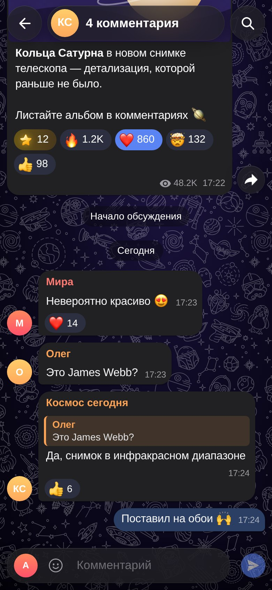

# TeleX — все каналы одной стеной

<div align="center">


**Неофициальный клиент Telegram для чтения каналов.**
Публикации всех ваших подписок — одной лентой, в интерфейсе Telegram для Android:
истории, комментарии, реакции, премиум-эмодзи.

[**Сайт**](https://telex-web.ru/) · [**Открыть в браузере**](https://telex-web.ru/app/static/) · [**Android APK**](https://github.com/Gl1ch5/TgX/releases/download/nightly/TeleX-android.apk) · [**Windows**](https://github.com/Gl1ch5/TgX/releases/tag/nightly)




</div>

---

## Возможности

- **Стена каналов** — новые посты из всех подписок в одной ленте; живые обновления, кнопка «новые посты», счётчик непрочитанного, синхронизация прочитанного с Telegram. Каналы можно скрыть со стены.
- **Шапка как в Telegram** — «TeleX» со стопкой историй; потяните вниз, чтобы раскрыть ряд историй.
- **Истории** — настоящие истории из Telegram: сегментные кольца, полноэкранный просмотр с жестами (тап, удержание, свайпы), видео со звуком, отметка просмотра.
- **Каналы** — экран канала с закреплённым сообщением, звуком и поиском; страница канала с описанием, ссылкой, «Публикациями» и «Медиа».
- **Комментарии** — обсуждения под постами, ответы, поиск, кнопки-ссылки, отправка своих комментариев.
- **Реакции** — обычные, премиум (custom emoji) и платные ⭐, контекстное меню как в Telegram, сохранение в галерею.
- **Профиль** — фото, имя и «О себе» можно менять прямо в TeleX; сохранённые истории профиля.
- **Скорость** — мгновенные размытые превью из самого сообщения, приоритетная очередь загрузок, потоковое видео, кэш медиа.
- **Оформление** — оригинальные иконки Telegram для Android, обои, размер текста, скругления, цвет акцента, режим энергосбережения.
- **Для разработчиков** — диагностика соединения, логи, экспорт/импорт сессии (Настройки → Для разработчиков).

## Как это работает

TeleX работает **целиком на вашем устройстве**: клиент Telegram (MTProto через защищённый WebSocket, [GramJS](https://github.com/gram-js/gramjs)) запускается прямо на странице, своего сервера у проекта нет. Сессия хранится только в `localStorage`. «Выйти» завершает сессию в Telegram и стирает локальные данные.

> Если Telegram в вашей сети заблокирован, нужен VPN — приложение подключается к серверам Telegram напрямую.

## Вход

- **QR-код** — в Telegram на телефоне: Настройки → Устройства → Подключить устройство, наведите камеру. При облачном пароле (2FA) введите его.
- **Номер телефона** — номер в международном формате, затем код из Telegram/SMS и, если есть, облачный пароль.

## Android

Нативная оболочка (WebView), которая открывает живой сайт, поэтому всегда актуальна. Плюс: прозрачная строка состояния, кнопка «Назад» закрывает вложенные экраны, ссылки `t.me` открываются в Telegram, сохранение фото и видео в галерею, переподключение после сна, экран «Нет соединения» и **автообновление**: приложение само находит новую сборку в релизе `nightly`, скачивает её и предлагает установить.

1. Скачайте [`TeleX-android.apk`](https://github.com/Gl1ch5/TgX/releases/download/nightly/TeleX-android.apk).
2. Разрешите установку из неизвестных источников, когда Android попросит.
3. Дальше обновления приходят сами; вход в Telegram сохраняется.

Требуется Android 7.0+. Сборка: `cd native/android && ./gradlew assembleDebug` (JDK 17 + Android SDK). Адрес сайта — в `AppConfig.kt`.

## Windows

Окно Electron с сайтом TeleX: своя иконка, запоминание размера, сессия и кэш между запусками, внешние ссылки в браузере.
[Релиз nightly](https://github.com/Gl1ch5/TgX/releases/tag/nightly): `TeleX-Setup.exe` (установщик) или `TeleX-Portable.exe`.

> Файлы без цифровой подписи — SmartScreen может предупредить: «Подробнее» → «Выполнить в любом случае».

Сборка: `cd native/desktop && npm ci && npm run dist:win` (Node.js 22+).

## Для разработчика

```bash
python run.py              # статический сервер на http://localhost:8000 (лендинг + приложение)
```

- `index.html`, `site/` — лендинг (корень GitHub Pages).
- `app/static/` — само приложение: `js/telegram.js` (GramJS-клиент), `js/views/*` (экраны), `js/components/*`, `css/tx/*`, `sw.js` (Service Worker: медиа и стриминг).
- `native/android`, `native/desktop` — оболочки; сборки в `.github/workflows/android.yml` и `windows.yml` публикуют релиз `nightly` (Android вместе с `version.json` для автообновления).
- `tools/gramjs` — браузерная сборка GramJS: `cd tools/gramjs && npm install && npm run build`.
- `tools/icons/extract.py` — достаёт оригинальные иконки Telegram для Android (векторы → SVG, растр из xxhdpi) и генерирует `css/tx/icons-android.css`:
  `python3 tools/icons/extract.py <путь к клону DrKLO/Telegram>`.

Подробнее об архитектуре — в [AGENT.md](AGENT.md).

## Автор

**[@grzxk](https://t.me/grzxk)** · [github.com/Gl1ch5](https://github.com/Gl1ch5)

## Лицензия

Код — MIT ([LICENSE](LICENSE)). Иконки в `app/static/icons/android/` взяты из открытых исходников [Telegram для Android](https://github.com/DrKLO/Telegram) (GPLv2).
TeleX — неофициальный клиент и не связан с Telegram FZ-LLC.
