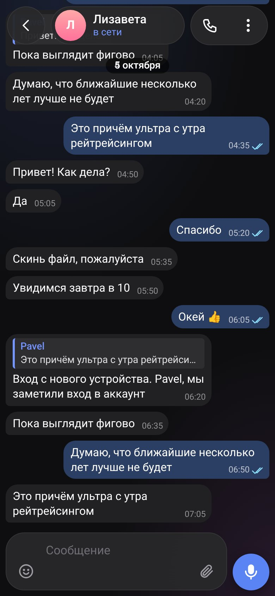

# Telegram You

Неофициальный веб-клиент Telegram, который повторяет **Telegram для Android** до пикселя: те же иконки, размеры, меню, анимации, обои и цвета. Работает в браузере (в том числе как PWA на телефоне), без сервера: клиент Telegram ([GramJS](https://github.com/gram-js/gramjs), MTProto по WebSocket) запускается прямо на странице.

<div align="center">


</div>

## Возможности

- Список чатов: папки, архив, закреп, «без звука», счётчики, галочки прочитанного, поиск (локальный и глобальный).
- Переписка: пузыри с хвостиками, ответы, пересылки, фото, видео, голосовые, файлы, реакции, закреплённые сообщения, поиск по чату, режим выбора, свайп для ответа, «печатает…», онлайн-статусы.
- Отправка текста и файлов (вставка, перетаскивание), правка, удаление, пересылка.
- Профиль контакта, группы и канала, общие медиа, меню как в Telegram.
- Обои и цветовая тема чата подгружаются из Telegram.
- Вход как в Telegram: номер, код, облачный пароль, QR.
- Русский, английский, испанский, португальский, украинский; светлая и тёмная тема по устройству.
- Расширения (моды): ES-модули с полным доступом к API, подключаются через точки расширения.

## Запуск

```bash
npm install          # только для тестов и сборки переводов
npm run serve        # http://localhost:8765
```

Демо без аккаунта Telegram: `http://localhost:8765/?fake=1`.

Это статические файлы: подойдёт любой хостинг (GitHub Pages, Cloudflare Pages, nginx). Для работы нужен HTTPS или localhost (Service Worker).

## Проверки

```bash
npm test             # Playwright: 5 языков × светлая/тёмная тема, отправка, моды, переводы
npm run i18n         # проверка и сборка словарей (tools/i18n/translations.txt → js/lang/*.js)
```

## Структура

| Путь | Что там |
|---|---|
| `index.html`, `css/chat.css` | разметка и стили клиента |
| `js/ui/` | интерфейс: `app.js` (запуск), `list.js`, `conv.js`, `profile.js`, `pages.js`, `panel.js`, `ext.js` + `mods.js` (расширения), `fake.js` (демо) |
| `js/telegram.js`, `js/telegram-chat.js` | движок Telegram: вход, диалоги, история, отправка, обновления |
| `js/telegram-remote.js`, `js/tg-worker.js` | тот же движок в Web Worker |
| `sw.js`, `js/media.js` | Service Worker и мост загрузки медиа |
| `icons/android/`, `icons/tabs/` | оригинальные ресурсы Telegram для Android |
| `tools/` | сборка GramJS, переводы, извлечение иконок, тесты |
| `docs/` | [архитектура](docs/architecture.md), [дорожная карта](docs/roadmap.md), [заметки по API](docs/telegram-api.md), [тестирование](docs/testing.md), [точность копии](docs/fidelity.md) |

Агентам и новым разработчикам: сначала [AGENT.md](AGENT.md).

## Лицензия

Код — MIT ([LICENSE](LICENSE)). Иконки и анимации в `icons/` взяты из открытых исходников [Telegram для Android](https://github.com/DrKLO/Telegram) (GPLv2). Проект неофициальный и не связан с Telegram FZ-LLC.
